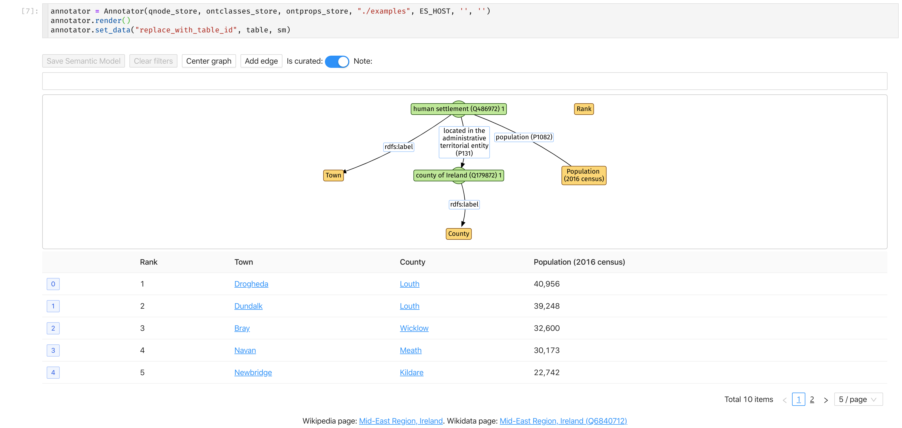

SM-widgets is a collection of widgets for annotate/visualize semantic models

## Usage

Checkout [annotator](examples/annotator.ipynb) notebooks

## Installation

```bash
pip install sm-widgets[integration]
```

## Screenshots

